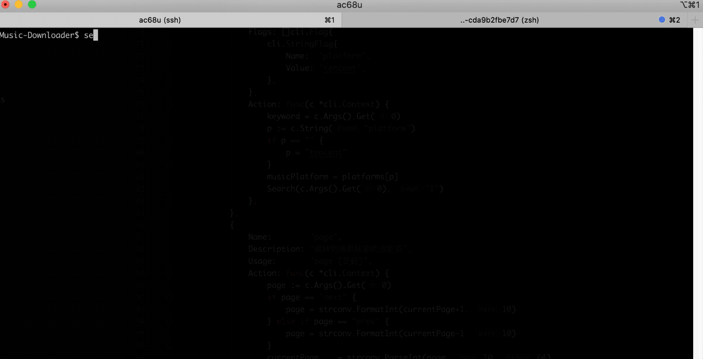

## 介绍
这是golang写的一个音乐检索，下载小工具。
本项目只是为了学习golang为目的，请支持正版音乐。

## 使用
* 歌曲搜索`search [关键字]`
* 搜索结果翻页：下一页 `page next`， 上一页 `page prev`, 指定页 `page [页数]`
* 下载歌曲：下载当前页所有歌曲 `download all`，下载指定歌曲 `download 0,1,2`

## 支持音乐平台
- [x] 腾讯
- [ ] 虾米
- [ ] 网易
- [ ] 酷狗

## 特别鸣谢
很惭愧，我并没有去网页版研究各个音乐平台的api，而是直接使用了这位大佬的成果。
* [https://github.com/metowolf/Meting](https://github.com/metowolf/Meting)

## License
[MIT](LICENSE)